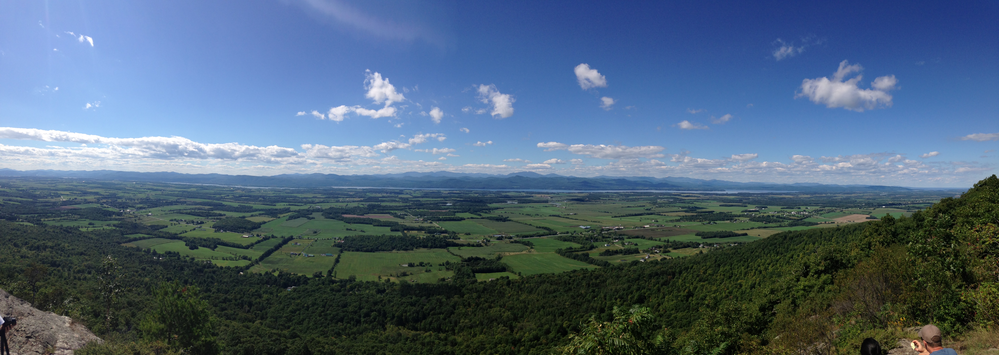

## About Me! 

I am Biostatistic PhD student at Columbia University in the Mailman School of Public Health. My research interests are in functional data science, causal inference, missing data and baysian statistics.  I am currently helping run the Computing Club and we have biweekly meetings. To find out more about this organization and the topics we cover please visit our [website](http://cu-biostats-computing-club.org/)! 

I received my B.S. degree (May 2020) at Marist College double majoring in Applied Mathematics and Data Analytics while minoring in Computer Science. I graduated Summa Cum Laude and with a Baculorate award in Mathematics and Honors in the major of mathematics.   I was the President of the Association for Women in Mathematics chapter and Pi Mu Epsilon chapter at Marist, the Vice-President of the Marist Math Club, and treasurer of the Marist College Equestrian team.     

## CV 
My CV is linked below! 

## Not Acedemic Related 
I am original from Vermont and am a small town girl at heart but am currently living in a big city. If I am not spending time on my courses or research you can find me at a horse barn, somewhere outdoors in nature, or quietly embroidering at home. 

